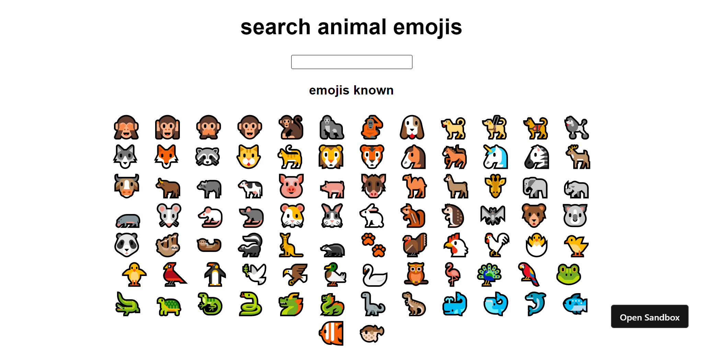

# Animal emoji interpreter

This is an animal emoji interpreter app which takes animal emoji as input and displays the meaning of that emoji.

## Overview

### Screenshot



### Links

- Live Site URL: [https://1pqr4.csb.app/](https://1pqr4.csb.app/)

## My process

### Built with

- React

### What I learned

- Writing JSX.
- Using React functional components.
- Using setState hook.

```js
const [meaning, setMeaning] = useState("");
```

## Author

- Twitter - [@DarshanDamre](https://twitter.com/DarshanDamre)
- LinkedIn - [Darshan Damre](https://www.linkedin.com/in/darshandamre/)
- Website - [Darshan Damre](https://darshandamre.netlify.app/)
